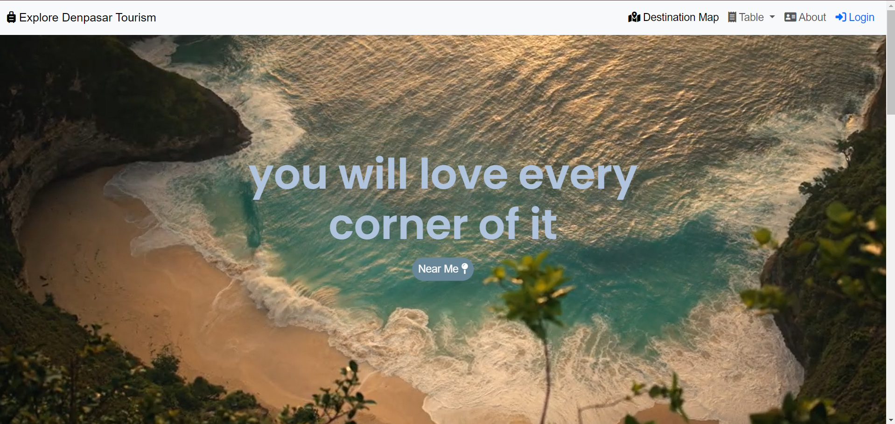

# pgweb-responsi

# Explore Denpasar Tourism

## Deskripsi Produk

Denpasar Tourism adalah laman yang menampilkan informasi seputar tempat wisata di Kota Denpasar Bali. Website ini memberikan informasi detail tentang lokasi-lokasi tersebut, termasuk deskripsi lokasi wisata. Denpasar Tourism ini dibuat untuk memenuhi tugas responsi Praktikum Pemrograman Web Lanjut.

## Komponen Pembangun Produk

- **HTML:** Digunakan untuk struktur dasar halaman web.
- **CSS:** Menangani tata letak dan desain halaman.
- **Bootstrap:** Framework CSS untuk mempercepat pengembangan antarmuka pengguna yang responsif.
- **Leaflet.js:** Library JavaScript untuk menangani peta interaktif.
- **Geoserver:** Sebagai server GIS untuk menyediakan dan mengelola data geospasial.
- **Laravel:** Sebagai framework PHP yang kuat dan fleksibel, menyediakan banyak fitur dan kemudahan untuk membangun aplikasi web, termasuk aplikasi Geographic Information System (GIS).

## Sumber Data

- Data informasi wisata (https://www.pariwisata.denpasarkota.go.id/).
- Data geospasial diakses melalui [InaGeoportal](https://www.inageoportal.id/), menyediakan informasi geospasial Indonesia.
- Data titik lokasi diperoleh dari google maps (https://www.google.com/maps), untuk informasi longitude dan latitude.

## Tangkapan Layar Komponen Penting Produk

1. **Antarmuka Utama:**
   

2. **Halaman Wisata:**
   

3. **Halaman Deskripsi Wisata:**
   

4. **Halaman Kuliner:**
   

5. **Halaman Deskripsi Kuliner:**
   

6. **Halaman Hotel:**
   

7. **Halaman Deskripsi Hotel:**
   
